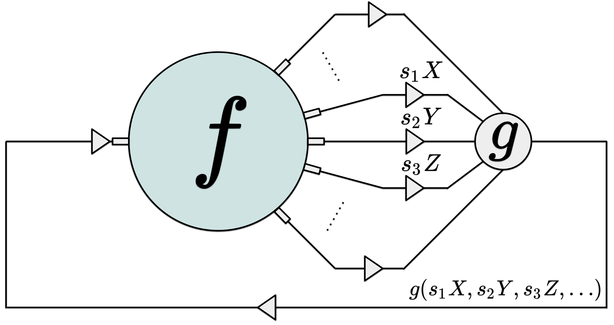

# CVF-SID_PyTorch

This repository contains the official code to reproduce the results from the paper:

**CVF-SID: Cyclic multi-Variate Function for Self-Supervised Image Denoising by Disentangling  Noise from Image (CVPR 2022)**

\[[arXiv](https://arxiv.org/abs/2203.13009)\] \[[presentation]()\] 

<p align="center">
  &nbsp;&nbsp;&nbsp;&nbsp;
 
</p>  
## Installation
Clone this repository into any place you want.
```
git clone https://github.com/Reyhanehne/CVF-SID_PyTorch.git
cd CVF-SID_PyTorch
```
### Dependencies
* Python 3.8.5
* PyTorch 1.7.1
* numpy
* Pillow
* torchvision
* scipy


## Expriments
### Reults of the SIDD validation dataset
<p align="center">
 &nbsp;&nbsp;&nbsp;&nbsp;&nbsp;&nbsp;&nbsp;&nbsp;&nbsp;  
</p>
To train and evaluate the model directly please visit [SIDD](https://www.eecs.yorku.ca/~kamel/sidd/benchmark.php) website or [Drive](https://drive.google.com/drive/folders/1cG6uCUZcBMzulkw6g9ImBOIxy_cLtiLo?usp=sharing) and download the original `Noisy sRGB data` and `Ground-truth sRGB data` from `SIDD Validation Data and Ground Truth` and place them in `data/SIDD_Small_sRGB_Only` folder.

#### Pretrained model
Download `config.json` and `model_best.pth` from this [link](https://drive.google.com/drive/folders/1flr_Oh_f1_0SO9qX2jBIGJBenYJ73-D0?usp=sharing) and save them in `models/CVF_SID/SIDD_Val/` folder.
#### NOTE: The pretrained model is updated at March. 9th 2022. 

You can now go to src folder and test our CVF-SID by:
```
python test.py --device 0 --config ../models/CVF_SID/SIDD_Val/config.json --resume ../models/CVF_SID/SIDD_Val/model_best.pth
```

or you can train it by yourself as follows:
```
python train.py --device 0 --config config_SIDD_Val.json --tag SIDD_Val
```


### Citation
If you find our code or paper useful, please consider citing:
```
@inproceedings{Neshatavar2022CVFSIDCM,
  title={CVF-SID: Cyclic multi-Variate Function for Self-Supervised Image Denoising by Disentangling Noise from Image},
  author={Reyhaneh Neshatavar and Mohsen Yavartanoo and Sanghyun Son and Kyoung Mu Lee},
  booktitle={IEEE/CVF Conference on Computer Vision and Pattern Recognition (CVPR)},
  year={2022}
}
```
